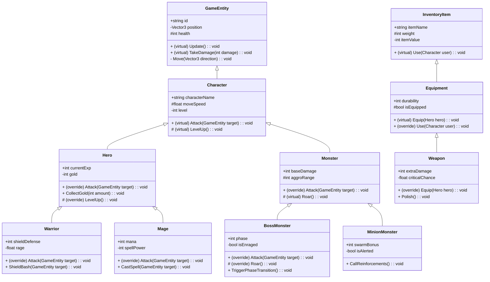
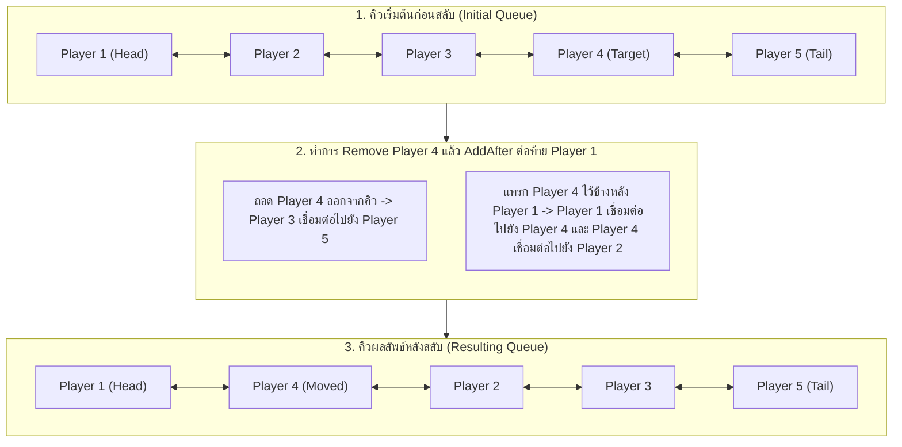

# ข้อสอบกลางภาค (Midterm Examination)
**วิชา:** GI262 การพัฒนาเกมด้วยโครงสร้างข้อมูลและการเขียนโปรแกรมเชิงวัตถุ  
**ภาคการศึกษา:** 1/2026 | มหาวิทยาลัยกรุงเทพ (Bangkok University)  
**โฟลเดอร์หลักของข้อสอบ:** `Assets/Midterm Exam/`

---

## 🎯 จุดประสงค์การสอบ (Examination Objectives)

1. **Object-Oriented Programming (OOP):**
   - เข้าใจและประยุกต์ใช้หลักการ Encapsulation ผ่าน Access Modifiers (`public`, `protected`, `private`)
   - เข้าใจและออกแบบความสัมพันธ์แบบ Inheritance ทั้ง Single-level และ Multi-level
   - เข้าใจ Polymorphism ผ่านการใช้งาน `virtual` และ `override` methods
   - สามารถแปลง Class Diagram ให้เป็นโค้ด C# ที่ถูกต้อง ครบถ้วน และ Compile ผ่าน
2. **Data Structures & Algorithms (LinkedList & Sorting):**
   - เข้าใจโครงสร้างและการทำงานของ `LinkedList<T>` และ `LinkedListNode<T>`
   - สามารถนำ Algorithm การเรียงลำดับ (Sorting) เช่น Bubble Sort, Selection Sort หรือ Insertion Sort มาประยุกต์ใช้กับโหนดของ Linked List ได้จริง
3. **LinkedList Node Manipulation & Game Queue Logic:**
   - เข้าใจการประยุกต์ใช้ Doubly Linked List กับระบบจัดการคิวเทิร์น (Turn-Based Queue) ในเกม
   - สามารถค้นหา โยกย้าย ถอดถอน (Remove) และแทรกโหนด (Insert/AddAfter) ในตำแหน่งที่ถูกต้อง
   - จัดการ Edge Cases และรักษาความสมบูรณ์ของ Pointer สองทิศทาง (`Next` และ `Previous`) ของ Doubly Linked List

---

## 📚 โครงสร้างของข้อสอบ (Exam Structure)

ข้อสอบมีทั้งหมด **3 ข้อใหญ่**:

| ข้อที่ | หัวข้อ | ตำแหน่งโฟลเดอร์ | รายละเอียด |
| :--- | :--- | :--- | :--- |
| **Problem 01** | OOP & Class Diagram Implementation | `Assets/Midterm Exam/Prob01-ClassDiagram/` | นำ Class Diagram ระบบตัวละครและอุปกรณ์ในเกม (11 Classes) มาเขียนโค้ดตามโครงสร้าง ตัวแปร และ Access Modifiers ที่กำหนด |
| **Problem 02** | LinkedList Sorting Algorithm | `Assets/Midterm Exam/Prob02-Sorting/` | เขียน Algorithm เรียงลำดับข้อมูลตัวเลขจำนวนเต็ม (`LinkedList<int>`) ทั้งจากน้อยไปมาก และจากมากไปน้อย |
| **Problem 03** | Turn-Based Queue Manipulation | `Assets/Midterm Exam/Prob03-TurnQueue/` | พัฒนาระบบจัดการคิวเทิร์นด้วย `LinkedList<Player>` และเขียนเมธอด `SwapQueue` สำหรับสลับลำดับการเล่นของตัวละครในเกม |

---

## 📝 Problem 01: Class Diagram & OOP Implementation

### รายละเอียดโจทย์
ให้นักศึกษาเปิดโฟลเดอร์ `Assets/Midterm Exam/Prob01-ClassDiagram/` ซึ่งจะมีไฟล์ Boilerplate (.cs) ว่างเปล่าเตรียมไว้ให้ทั้งหมด 11 คลาส (1 คลาสต่อ 1 ไฟล์) 

ให้นักศึกษาเขียนโค้ดภายใน namespace `MidtermExam.Prob01` ให้สมบูรณ์ถูกต้องตาม **Class Diagram** และข้อกำหนดด้านล่างนี้:
- ระบุ Base Class (Inheritance) ให้ถูกต้อง
- กำหนด Access Modifiers (`public`, `protected`, `private`) ให้ตรงกับเครื่องหมายใน Diagram:
  - `+` หมายถึง `public`
  - `#` หมายถึง `protected`
  - `-` หมายถึง `private`
- ประกาศ `virtual` ใน Base Class และ `override` ใน Derived Class ตามที่ระบุไว้
- ชนิดข้อมูล (Data Types), ชื่อตัวแปร, Parameters และ Return Types ต้องตรงตามสเปก 100%

---

### Class Diagram



---

### รายการ Test Cases สำหรับ Problem 01 (`Prob01_ClassDiagram_Testcase.cs`)

ชุดแบบทดสอบในไฟล์ `Assets/Midterm Exam/Tests/Prob01_ClassDiagram_Testcase.cs` ประกอบด้วย 13 Test Cases ดังนี้:

| Test Case ID & Method Name | หัวข้อการทดสอบ | สิ่งที่ตรวจสอบ |
| :--- | :--- | :--- |
| `TC01_ClassExistence_All11ClassesExist` | ตรวจสอบการมีอยู่ของคลาส | ตรวจสอบว่าคลาสครบทั้ง 11 คลาสใน namespace `MidtermExam.Prob01` |
| `TC02_Inheritance_AllRelationships` | ตรวจสอบ Inheritance Hierarchy | ตรวจสอบความสัมพันธ์การสืบทอดคลาสของทั้ง 11 คลาสตาม Diagram |
| `TC03_GameEntity_Structure` | สมาชิกคลาส `GameEntity` | ฟิลด์ `id`, `position`, `health` และเมธอด `Update`, `TakeDamage`, `Move` |
| `TC04_Character_Structure` | สมาชิกคลาส `Character` | ฟิลด์ `characterName`, `moveSpeed`, `level` และเมธอด `Attack`, `LevelUp` |
| `TC05_Hero_Structure` | สมาชิกคลาส `Hero` | ฟิลด์ `currentExp`, `gold` และเมธอด `Attack` (override), `CollectGold`, `LevelUp` (override) |
| `TC06_Warrior_Structure` | สมาชิกคลาส `Warrior` | ฟิลด์ `shieldDefense`, `rage` และเมธอด `Attack` (override), `ShieldBash` |
| `TC07_Mage_Structure` | สมาชิกคลาส `Mage` | ฟิลด์ `mana`, `spellPower` และเมธอด `Attack` (override), `CastSpell` |
| `TC08_Monster_Structure` | สมาชิกคลาส `Monster` | ฟิลด์ `baseDamage`, `aggroRange` และเมธอด `Attack` (override), `Roar` (virtual) |
| `TC09_BossMonster_Structure` | สมาชิกคลาส `BossMonster` | ฟิลด์ `phase`, `isEnraged` และเมธอด `Attack` (override), `Roar` (override), `TriggerPhaseTransition` |
| `TC10_MinionMonster_Structure` | สมาชิกคลาส `MinionMonster` | ฟิลด์ `swarmBonus`, `isAlerted` และเมธอด `CallReinforcements` |
| `TC11_InventoryItem_Structure` | สมาชิกคลาส `InventoryItem` | ฟิลด์ `itemName`, `weight`, `itemValue` และเมธอด `Use` (virtual) |
| `TC12_Equipment_Structure` | สมาชิกคลาส `Equipment` | ฟิลด์ `durability`, `isEquipped` และเมธอด `Equip` (virtual), `Use` (override) |
| `TC13_Weapon_Structure` | สมาชิกคลาส `Weapon` | ฟิลด์ `extraDamage`, `criticalChance` และเมธอด `Equip` (override), `Polish` |

---

### รายละเอียดข้อกำหนดแต่ละคลาส (Class Specifications)

#### 1. `GameEntity` (ไฟล์ `GameEntity.cs`) -> ตรวจสอบโดย `TC03_GameEntity_Structure`
Base class สูงสุดสำหรับ Entity ในเกม
- **Fields:**
  - `public string id;`
  - `private Vector3 position;`
  - `protected int health;`
- **Methods:**
  - `public virtual void Update()`
  - `public virtual void TakeDamage(int damage)`: หักลบค่า `damage` ออกจาก `health`
  - `private void Move(Vector3 direction)`: เพิ่มตำแหน่ง `position += direction`

#### 2. `Character` (ไฟล์ `Character.cs`) -> ตรวจสอบโดย `TC04_Character_Structure`
สืบทอดจาก `GameEntity`
- **Fields:**
  - `public string characterName;`
  - `protected float moveSpeed;`
  - `private int level;`
- **Methods:**
  - `public virtual void Attack(GameEntity target)`
  - `protected virtual void LevelUp()`: เพิ่มค่า `level` ขึ้น 1

#### 3. `Hero` (ไฟล์ `Hero.cs`) -> ตรวจสอบโดย `TC05_Hero_Structure`
สืบทอดจาก `Character`
- **Fields:**
  - `public int currentExp;`
  - `private int gold;`
- **Methods:**
  - `public override void Attack(GameEntity target)`
  - `public void CollectGold(int amount)`: เพิ่มค่า `amount` ให้กับ `gold`
  - `protected override void LevelUp()`: เรียก implementation จาก base class และรีเซ็ต `currentExp = 0`

#### 4. `Warrior` (ไฟล์ `Warrior.cs`) -> ตรวจสอบโดย `TC06_Warrior_Structure`
สืบทอดจาก `Hero`
- **Fields:**
  - `public int shieldDefense;`
  - `private float rage;`
- **Methods:**
  - `public override void Attack(GameEntity target)`
  - `public void ShieldBash(GameEntity target)`: สั่งให้ target ได้รับความเสียหาย

#### 5. `Mage` (ไฟล์ `Mage.cs`) -> ตรวจสอบโดย `TC07_Mage_Structure`
สืบทอดจาก `Hero`
- **Fields:**
  - `public int mana;`
  - `private int spellPower;`
- **Methods:**
  - `public override void Attack(GameEntity target)`
  - `public void CastSpell(GameEntity target)`: โจมตี target ด้วยเวทมนตร์และลดค่า `mana`

#### 6. `Monster` (ไฟล์ `Monster.cs`) -> ตรวจสอบโดย `TC08_Monster_Structure`
สืบทอดจาก `Character`
- **Fields:**
  - `public int baseDamage;`
  - `protected int aggroRange;`
- **Methods:**
  - `public override void Attack(GameEntity target)`: สั่ง `target.TakeDamage(baseDamage)`
  - `protected virtual void Roar()`

#### 7. `BossMonster` (ไฟล์ `BossMonster.cs`) -> ตรวจสอบโดย `TC09_BossMonster_Structure`
สืบทอดจาก `Monster`
- **Fields:**
  - `public int phase;`
  - `private bool isEnraged;`
- **Methods:**
  - `public override void Attack(GameEntity target)`
  - `protected override void Roar()`
  - `public void TriggerPhaseTransition()`: เพิ่ม `phase++` และปรับ `isEnraged = true`

#### 8. `MinionMonster` (ไฟล์ `MinionMonster.cs`) -> ตรวจสอบโดย `TC10_MinionMonster_Structure`
สืบทอดจาก `Monster`
- **Fields:**
  - `public int swarmBonus;`
  - `private bool isAlerted;`
- **Methods:**
  - `public void CallReinforcements()`: ปรับ `isAlerted = true`

#### 9. `InventoryItem` (ไฟล์ `InventoryItem.cs`) -> ตรวจสอบโดย `TC11_InventoryItem_Structure`
Base class ของไอเทมทั้งหมด
- **Fields:**
  - `public string itemName;`
  - `protected int weight;`
  - `private int itemValue;`
- **Methods:**
  - `public virtual void Use(Character user)`

#### 10. `Equipment` (ไฟล์ `Equipment.cs`) -> ตรวจสอบโดย `TC12_Equipment_Structure`
สืบทอดจาก `InventoryItem`
- **Fields:**
  - `public int durability;`
  - `protected bool isEquipped;`
- **Methods:**
  - `public virtual void Equip(Hero hero)`: ปรับ `isEquipped = true`
  - `public override void Use(Character user)`

#### 11. `Weapon` (ไฟล์ `Weapon.cs`) -> ตรวจสอบโดย `TC13_Weapon_Structure`
สืบทอดจาก `Equipment`
- **Fields:**
  - `public int extraDamage;`
  - `private float criticalChance;`
- **Methods:**
  - `public override void Equip(Hero hero)`
  - `public void Polish()`: เพิ่มค่า `durability` หรือประสิทธิภาพของอาวุธ

---

## 🔢 Problem 02: Sorting LinkedList of Integers

### ความเป็นมาและขอบเขตเนื้อหา
ในสัปดาห์ที่ 4 (Week 04) นักศึกษาได้เรียนรู้โครงสร้างของ **Doubly Linked List** ใน C# (`LinkedList<T>` และ `LinkedListNode<T>`) รวมถึง Operations พื้นฐาน:
- การเข้าถึงโหนด: `list.First`, `list.Last`, `node.Next`, `node.Previous`, `node.Value`
- การเพิ่ม/ลบโหนด: `list.AddFirst()`, `list.AddLast()`, `list.AddBefore()`, `list.AddAfter()`, `list.Remove()`, `list.RemoveFirst()`, `list.RemoveLast()`

ในสัปดาห์ที่ 5 (Week 05) นักศึกษาได้เรียนรู้ Algorithm การเรียงลำดับ (Sorting Algorithms) บน Array:
- **Selection Sort**
- **Bubble Sort**
- **Insertion Sort**

### รายละเอียดโจทย์
ในข้อสอบนี้ นักศึกษาจะต้อง **นำ Algorithm การเรียงลำดับ มาประยุกต์ใช้กับ Doubly Linked List (`LinkedList<int>`)** ซึ่งเป็นโจทย์ที่ท้าทายและทดสอบความเข้าใจลึกซึ้งในการจัดการ Node และ Pointer ในหน่วยความจำ

> [!IMPORTANT]
> **กฎเกณฑ์ข้อบังคับสำหรับการทำ Problem 02 (Mandatory Rule):**
> - นักศึกษา**ต้องเลือกใช้อัลกอริทึมการเรียงลำดับ 1 ใน 3 อัลกอริทึม** ที่ได้เรียนในวิชานี้เท่านั้น ได้แก่:
>   1. **Bubble Sort**
>   2. **Selection Sort**
>   3. **Insertion Sort**
> - ❌ **ข้อห้ามเด็ดขาด:** ไม่อนุญาตให้ใช้ Built-in Methods หรือ C# Libraries สำเร็จรูป เช่น LINQ (`OrderBy`, `OrderByDescending`), `Array.Sort()`, `List<T>.Sort()` หรือการแปลง `LinkedList` เป็น `List`/`Array` เพื่อ Sort ผ่านฟังก์ชันสำเร็จรูปของภาษาแล้วแปลงกลับ หากตรวจพบโค้ดในลักษณะนี้จะถือว่าผิดวัตถุประสงค์การสอบ และจะไม่ได้รับคะแนนในข้อนี้

ให้นักศึกษาเปิดไฟล์ `Assets/Midterm Exam/Prob02-Sorting/LinkedListSorter.cs` ใน namespace `MidtermExam.Prob02` และ Implement 2 methods:

```csharp
namespace MidtermExam.Prob02
{
    public class LinkedListSorter
    {
        // ข้อ 2.1: เรียงลำดับจากน้อยไปมาก
        public LinkedList<int> SortAscending(LinkedList<int> list)
        {
            // TODO: Implement sorting logic
            return list;
        }

        // ข้อ 2.2: เรียงลำดับจากมากไปน้อย
        public LinkedList<int> SortDescending(LinkedList<int> list)
        {
            // TODO: Implement sorting logic
            return list;
        }
    }
}
```

---

### แนวทางการแก้ปัญหาด้วย 3 Sorting Algorithms (Algorithmic Approaches)
นักศึกษาสามารถเลือก Algorithm ใด Algorithm หนึ่งจาก 3 รูปแบบตามความถนัด:

1. **Selection Sort บน LinkedList:**
   - วน Loop โหนดหลัก `LinkedListNode<int> i = list.First`
   - วน Loop โหนดเปรียบเทียบ `LinkedListNode<int> j = i.Next` จนถึง `null` เพื่อหาโหนดที่มีค่าน้อยที่สุด (กรณี Ascending) หรือมากที่สุด (กรณี Descending)
   - สลับค่า (Swap) ระหว่าง `i.Value` และโหนดที่ค้นพบ
2. **Bubble Sort บน LinkedList:**
   - วน Loop ตรวจสอบคู่โหนดที่อยู่ติดกันซ้ำๆ ตั้งแต่ `list.First` จนถึงปลายคิว
   - เปรียบเทียบ `current.Value` และ `current.Next.Value` หากเรียงผิดลำดับให้สลับค่า (Swap) ระหว่างกัน
   - ทำซ้ำจนกระทั่งไม่มีคู่ใดต้องสลับอีก (Sorted สมบูรณ์)
3. **Insertion Sort บน LinkedList:**
   - สร้าง `LinkedList<int> sortedList = new LinkedList<int>()`
   - วน Loop ดึงตัวเลขจาก `list` เดิมทีละตัว แล้วนำไปแทรกใน `sortedList` ให้ถูกตำแหน่งโดยใช้ `AddBefore` หรือ `AddLast`
4. **ข้อควรระวังสำหรับ Edge Cases:**
   - หาก `list == null` หรือ `list.Count <= 1` ไม่จำเป็นต้องเรียงลำดับ สามารถ Return คืนค่ากลับได้ทันที

---

### รายการ Test Cases สำหรับ Problem 02 (`Prob02_Sorting_Testcase.cs`)

แบบทดสอบในไฟล์ `Assets/Midterm Exam/Tests/Prob02_Sorting_Testcase.cs` มีทั้งหมด **24 Test Cases** แบ่งออกเป็น 4 หมวดหมู่อย่างชัดเจน เพื่อให้นักศึกษาสามารถสังเกตชื่อ Method ใน Unity Test Runner และเทียบกับคำสั่ง ข้อมูลนำเข้า (Input) และผลลัพธ์ที่คาดหวัง (Expected Output) ได้ทันที:

#### หมวดที่ 1: Edge Cases (กรณีพิเศษและข้อมูลขอบเขต - TC01 ถึง TC06)

| Test Case Method Name | คำอธิบายกรณีทดสอบ | Input (`LinkedList<int>`) | Expected SortAscending | Expected SortDescending |
| :--- | :--- | :--- | :--- | :--- |
| `TC01_Edge_NullList` | ส่งค่า `null` เข้ามา (ต้องไม่ throw Exception) | `null` | `null` | `null` |
| `TC02_Edge_EmptyList` | รายการว่างเปล่า (Empty List) | `[]` | `[]` | `[]` |
| `TC03_Edge_SingleElement` | มีสมาชิกเพียงโหนดเดียว | `[42]` | `[42]` | `[42]` |
| `TC04_Edge_TwoElements_AlreadySorted` | สองโหนดที่เรียงถูกต้องอยู่แล้ว | Asc: `[10, 20]`<br>Desc: `[20, 10]` | `[10, 20]` | `[20, 10]` |
| `TC05_Edge_TwoElements_Inverted` | สองโหนดที่สลับตำแหน่งกัน | Asc: `[20, 10]`<br>Desc: `[10, 20]` | `[10, 20]` | `[20, 10]` |
| `TC06_Edge_AllIdenticalElements` | ทุกโหนดมีค่าเท่ากันทั้งหมด | `[7, 7, 7, 7, 7]` | `[7, 7, 7, 7, 7]` | `[7, 7, 7, 7, 7]` |

#### หมวดที่ 2: SortAscending Scenarios (เรียงลำดับจากน้อยไปมาก - TC07 ถึง TC13)

| Test Case Method Name | คำอธิบายกรณีทดสอบ | Input (`LinkedList<int>`) | Expected Output (น้อยไปมาก) |
| :--- | :--- | :--- | :--- |
| `TC07_SortAsc_BasicUnsorted` | รายการทั่วไป 5 จำนวน | `[5, 2, 8, 1, 9]` | `[1, 2, 5, 8, 9]` |
| `TC08_SortAsc_MediumUnsorted` | รายการขนาดกลาง 7 จำนวน | `[64, 34, 25, 12, 22, 11, 90]` | `[11, 12, 22, 25, 34, 64, 90]` |
| `TC09_SortAsc_AlreadySorted` | ข้อมูลเรียงจากน้อยไปมากอยู่แล้ว | `[1, 2, 3, 4, 5]` | `[1, 2, 3, 4, 5]` |
| `TC10_SortAsc_ReverseSorted` | ข้อมูลเรียงกลับหลัง (มากไปน้อย) | `[5, 4, 3, 2, 1]` | `[1, 2, 3, 4, 5]` |
| `TC11_SortAsc_WithDuplicates` | ข้อมูลมีตัวเลขซ้ำหลายตัว | `[4, 2, 7, 2, 4, 1, 7, 2]` | `[1, 2, 2, 2, 4, 4, 7, 7]` |
| `TC12_SortAsc_WithNegativesAndZero` | ข้อมูลมีจำนวนเต็มลบและศูนย์ | `[3, -1, 0, -5, 2, -1]` | `[-5, -1, -1, 0, 2, 3]` |
| `TC13_SortAsc_AllNegative` | ข้อมูลเป็นจำนวนเต็มลบทั้งหมด | `[-10, -50, -3, -20, -1]` | `[-50, -20, -10, -3, -1]` |

#### หมวดที่ 3: SortDescending Scenarios (เรียงลำดับจากมากไปน้อย - TC14 ถึง TC20)

| Test Case Method Name | คำอธิบายกรณีทดสอบ | Input (`LinkedList<int>`) | Expected Output (มากไปน้อย) |
| :--- | :--- | :--- | :--- |
| `TC14_SortDesc_BasicUnsorted` | รายการทั่วไป 5 จำนวน | `[5, 2, 8, 1, 9]` | `[9, 8, 5, 2, 1]` |
| `TC15_SortDesc_MediumUnsorted` | รายการขนาดกลาง 7 จำนวน | `[64, 34, 25, 12, 22, 11, 90]` | `[90, 64, 34, 25, 22, 12, 11]` |
| `TC16_SortDesc_AlreadyDescending` | ข้อมูลเรียงจากมากไปน้อยอยู่แล้ว | `[9, 7, 5, 3, 1]` | `[9, 7, 5, 3, 1]` |
| `TC17_SortDesc_AscendingInput` | ข้อมูลเรียงจากน้อยไปมาก (ต้องกลับด้าน) | `[1, 3, 5, 7, 9]` | `[9, 7, 5, 3, 1]` |
| `TC18_SortDesc_WithDuplicates` | ข้อมูลมีตัวเลขซ้ำหลายตัว | `[4, 2, 7, 2, 4, 1, 7, 2]` | `[7, 7, 4, 4, 2, 2, 2, 1]` |
| `TC19_SortDesc_WithNegativesAndZero` | ข้อมูลมีจำนวนเต็มลบและศูนย์ | `[3, -1, 0, -5, 2, -1]` | `[3, 2, 0, -1, -1, -5]` |
| `TC20_SortDesc_AllNegative` | ข้อมูลเป็นจำนวนเต็มลบทั้งหมด | `[-10, -50, -3, -20, -1]` | `[-1, -3, -10, -20, -50]` |

#### หมวดที่ 4: Extreme & Stress Cases (กรณีขอบเขตและข้อมูลชุดใหญ่ - TC21 ถึง TC24)

| Test Case Method Name | คำอธิบายกรณีทดสอบ | Input (`LinkedList<int>`) | สิ่งที่แบบทดสอบนี้เน้นย้ำ |
| :--- | :--- | :--- | :--- |
| `TC21_Extreme_IntegerMinMaxBounds` | ขอบเขตค่าสูงสุด-ต่ำสุด (`int.MinValue`, `int.MaxValue`) | `[int.MaxValue, 0, int.MinValue, -1, 1, 100, -100]` | ตรวจสอบว่า Algorithm ไม่เกิด Overflow เมื่อเปรียบเทียบค่า |
| `TC22_Extreme_ZigzagAlternatingPattern` | รูปแบบฟันปลา สลับค่าสูง-ต่ำ | `[1, 1000, 2, 999, 3, 998, 4, 997, 5, 996]` | ตรวจสอบการสลับตำแหน่งโหนดต่อเนื่องหลายคู่ |
| `TC23_Extreme_LargeList_500Elements` | ข้อมูลขนาดใหญ่ 500 โหนด เรียงกลับหลัง (500 ถึง 1) | `[500, 499, ..., 2, 1]` | ทดสอบ Stress test ป้องกัน Stack Overflow / Infinite Loop |
| `TC24_Extreme_RandomElements_300Elements` | ข้อมูลสุ่ม 300 จำนวน ช่วง [-5000, 5000] | สุ่ม 300 จำนวน (Seed 2026 คงที่) | ทดสอบความถูกต้องของ Pointer ทั้ง Forward (`Next`) และ Backward (`Previous`) |


---

## ⚔️ Problem 03: Turn-Based Queue Manipulation with LinkedList

### ความเป็นมาและขอบเขตเนื้อหา
ในเกมแนว Turn-Based RPG (เช่น Final Fantasy, Pokémon, Honkai: Star Rail) ลำดับการออกคำสั่งและการเคลื่อนไหวของตัวละครมักถูกควบคุมด้วยระบบ **Action Queue** หรือ **Turn Order** 
โครงสร้างข้อมูลที่เหมาะสมที่สุดในการจัดการคิวแบบนี้คือ **Doubly Linked List (`LinkedList<Player>`)** เนื่องจาก:
- ผู้เล่นที่เป็นโหนดแรกสุด (`list.First`) คือผู้ที่กำลังได้เล่นเทิร์นปัจจุบัน
- ผู้เล่นที่เป็นโหนดสุดท้าย (`list.Last`) คือผู้เล่นลำดับสุดท้ายของรอบ
- เมื่อผู้เล่นจบเทิร์น ระบบจะนำผู้เล่นคนแรกย้ายไปต่อท้ายคิว (`RemoveFirst()` แล้ว `AddLast()`) เพื่อวนรอบต่อไป
- ผู้เล่นสามารถใช้ **สกิลพิเศษแทรกแซงลำดับคิว (Turn Manipulation Ability)** เพื่อดึงเพื่อนร่วมทีมขึ้นมาเล่นก่อน หรือผลักศัตรูให้ไปเล่นทีหลังได้ทันที ด้วยความเร็วในการแทรกและถอดโหนดระดับ $O(1)$ เมื่อทราบ Pointer ของโหนด

---

### รายละเอียดโจทย์

ให้นักศึกษาเปิดโฟลเดอร์ `Assets/Midterm Exam/Prob03-TurnQueue/` จะพบกับคลาส `Player.cs` ภายใน namespace `MidtermExam.Prob03`

คลาส `Player` ประกอบด้วย 2 เมธอดหลัก:
1. **`public void Attack(Player target)`**: เมธอดจำลองการโจมตีเป้าหมาย (ลด Health ของเป้าหมาย 10 หน่วย) ซึ่งทางโจทย์ได้เขียนโค้ดเตรียมไว้ให้แล้ว เพื่อให้นักศึกษาเห็นภาพการนำไปใช้ในเกมจริง
2. **`public bool SwapQueue(LinkedList<Player> turnQueue, Player targetPlayer, Player afterPlayer)`**: **(ส่วนที่นักศึกษาต้องเขียน Implementation)** ความสามารถพิเศษในการเปลี่ยนลำดับคิว โดยนำ `targetPlayer` ออกจากตำแหน่งเดิม แล้วนำไปแทรกต่อท้าย `afterPlayer` (AddAfter)

```csharp
namespace MidtermExam.Prob03
{
    public class Player
    {
        public string Name;
        public int Health;

        public Player(string name, int health = 100)
        {
            Name = name;
            Health = health;
        }

        // เมธอดจำลองการโจมตี (มีโค้ดพร้อมใช้งานแล้ว)
        public void Attack(Player target)
        {
            if (target != null) target.TakeDamage(10);
        }

        public void TakeDamage(int damage)
        {
            Health = System.Math.Max(0, Health - damage);
        }

        // ข้อ 3.1: สกิลสลับตำแหน่งโหนดใน LinkedList คิวเทิร์น (นักศึกษาต้องเขียนโค้ดนี้)
        public bool SwapQueue(LinkedList<Player> turnQueue, Player targetPlayer, Player afterPlayer)
        {
            // TODO: Implement การย้าย targetPlayer ไปวางต่อท้าย afterPlayer ใน turnQueue
            return false;
        }
    }
}
```

---

### ภาพจำลองการทำงาน (Visual Demonstration)

สมมติว่าคิวการเล่นเริ่มต้นมีผู้เล่น 5 คน: `[Player 1] <-> [Player 2] <-> [Player 3] <-> [Player 4] <-> [Player 5]`  
เมื่อมีผู้เล่นเรียกใช้คำสั่ง: `SwapQueue(turnQueue, Player 4, Player 1)`  
เป้าหมายคือ: **ถอด `Player 4` ออกจากตำแหน่งเดิม แล้วนำไปแทรกต่อท้าย `Player 1`**



---

### ข้อกำหนดและกรณีขอบเขตที่ต้องตรวจสอบ (Specifications & Edge Cases)

เมธอด `SwapQueue` ต้องคืนค่า `bool` เพื่อระบุว่าการสลับคิวทำได้สำเร็จหรือไม่ โดยมีกฎเกณฑ์ดังนี้:

1. **การตรวจสอบความถูกต้องของข้อมูลนำเข้า (Validation Checks):**
   - หาก `turnQueue == null` ให้คืนค่า `false` ทันที
   - หาก `targetPlayer == null` หรือ `afterPlayer == null` ให้คืนค่า `false` ทันที
   - หากคิวมีสมาชิกน้อยกว่า 2 โหนด (`turnQueue.Count < 2`) ให้คืนค่า `false` ทันที (ไม่สามารถสลับได้)
   - หาก `targetPlayer == afterPlayer` (พยายามนำผู้เล่นไปวางต่อท้ายตัวเอง) ให้คืนค่า `false` ทันที
   - หาก `targetPlayer` หรือ `afterPlayer` ไม่ได้อยู่ใน `turnQueue` ให้คืนค่า `false` ทันที

2. **กรณีผู้เล่นอยู่ในตำแหน่งที่ถูกต้องอยู่แล้ว (Already In Position):**
   - หาก `targetPlayer` อยู่ต่อท้าย `afterPlayer` อยู่แล้วในคิว ให้ถือว่าการสลับสำเร็จและคืนค่า `true` โดยลำดับของคิวต้องคงเดิม

3. **การจัดการโหนดและพอยน์เตอร์ (Node & Pointer Integrity):**
   - ต้องถอดโหนด `targetPlayer` ออกจากตำแหน่งเดิมอย่างถูกต้อง (`turnQueue.Remove(...)`)
   - นำโหนด `targetPlayer` ไปแทรกต่อท้ายโหนด `afterPlayer` (`turnQueue.AddAfter(...)`)
   - กรณีที่ `targetPlayer` เป็นหัวคิวเดิม (`First`): หัวคิวใหม่ (`turnQueue.First`) ต้องเปลี่ยนเป็นโหนดถัดไปอย่างถูกต้อง และ `First.Previous` ต้องเป็น `null`
   - กรณีที่ `targetPlayer` เป็นท้ายคิวเดิม (`Last`): ท้ายคิวใหม่ (`turnQueue.Last`) ต้องเปลี่ยนเป็นโหนดก่อนหน้าอย่างถูกต้อง และ `Last.Next` ต้องเป็น `null`
   - กรณีที่ `afterPlayer` เป็นท้ายคิวเดิม (`Last`): เมื่อแทรก `targetPlayer` ต่อท้าย `afterPlayer` แล้ว `targetPlayer` ต้องกลายเป็นท้ายคิวคนใหม่ (`turnQueue.Last`)
   - โครงสร้าง Doubly Linked List ต้องมีความสมบูรณ์ 100% ทั้งการท่องไปข้างหน้า (`.Next`) และการท่องย้อนกลับ (`.Previous`)

---

### รายการ Test Cases สำหรับ Problem 03 (`Prob03_TurnQueue_Testcase.cs`)

แบบทดสอบในไฟล์ `Assets/Midterm Exam/Tests/Prob03_TurnQueue_Testcase.cs` มีทั้งหมด **12 Test Cases** แบ่งออกเป็น 4 หมวดหมู่ ครอบคลุมทุกสถานการณ์อย่างกระชับและครบถ้วน:

#### หมวดที่ 1: Validation & Edge Cases (TC01 ถึง TC03)

| Test Case Method Name | คำอธิบายกรณีทดสอบ | ข้อมูลนำเข้า | ผลลัพธ์ที่คาดหวัง |
| :--- | :--- | :--- | :--- |
| `TC01_Validation_NullInputs_ReturnsFalse` | ตรวจสอบ Arguments เป็น null ทั้ง 3 กรณี | `queue == null`, `target == null`, หรือ `after == null` | คืนค่า `false` ทุกกรณี ไม่ throw Exception และคิวไม่ถูกแก้ไข |
| `TC02_Validation_PlayerNotInQueue_ReturnsFalse` | ตรวจสอบผู้เล่นไม่อยู่ในคิว | `targetPlayer` หรือ `afterPlayer` ไม่อยู่ในคิว | คืนค่า `false` ทั้ง 2 กรณี และคิวคงเดิม |
| `TC03_Validation_SelfTargetAndSmallQueue_ReturnsFalse` | วางต่อท้ายตัวเอง หรือคิวมีคนไม่พอ | `target == after` หรือ คิวขนาด 1 คน | คืนค่า `false` ทั้ง 2 กรณี |

#### หมวดที่ 2: Queue Swapping Scenarios (TC04 ถึง TC07)

| Test Case Method Name | คำอธิบายกรณีทดสอบ | ข้อมูลก่อนสลับ | ผลลัพธ์คิวหลังสลับ |
| :--- | :--- | :--- | :--- |
| `TC04_Swap_PromptExample_MovePlayer4AfterPlayer1` | ตัวอย่างตามโจทย์: ย้าย Player 4 ไปต่อท้าย Player 1 | `[P1, P2, P3, P4, P5]` | `[P1, P4, P2, P3, P5]` คืนค่า `true` |
| `TC05_Swap_MoveForwardAndBackward` | สลับข้ามตำแหน่ง: หลังมาหน้า (P5 หลัง P2) และ หน้าไปหลัง (P2 หลัง P4) | `[P1, P2, P3, P4, P5]` | ย้ายถูกต้องทั้งสองทิศทาง คืนค่า `true` |
| `TC06_Swap_AdjacentAndAlreadyInPosition` | สลับคู่ติดกัน (P2 หลัง P3) และกรณีอยู่ถูกตำแหน่งแล้ว | `[P1, P2, P3, P4]` | สลับได้ถูกต้อง และกรณีอยู่ถูกที่แล้วคิวไม่เปลี่ยน คืนค่า `true` |
| `TC07_Swap_TwoPlayersList` | สลับคิวขนาดเล็กที่สุด 2 คน | `[P1, P2]` -> ย้าย P1 หลัง P2 | `[P2, P1]` คืนค่า `true` |

#### หมวดที่ 3: Boundary & Pointer Integrity (TC08 ถึง TC10)

| Test Case Method Name | คำอธิบายกรณีทดสอบ | สิ่งที่ตรวจสอบเป็นพิเศษ |
| :--- | :--- | :--- |
| `TC08_Boundary_MoveHeadAndTail` | ย้ายโหนดหัวคิว (`First`) และย้ายโหนดท้ายคิว (`Last`) ไปไว้ตรงกลาง | `queue.First` และ `queue.Last` อัปเดตถูกต้อง และ `First.Previous == null`, `Last.Next == null` |
| `TC09_Boundary_MovePlayerToBecomeNewTail` | ย้ายผู้เล่นไปต่อท้าย Last เดิม (กลายเป็น Tail ใหม่) และย้าย Head ไปเป็น Tail | `queue.Last` อัปเดตเป็นคนใหม่อย่างถูกต้องทั้งสองกรณี |
| `TC10_Integrity_BidirectionalPointers` | ตรวจสอบความสมบูรณ์ของ Pointer สองทิศทางทั้งคิว 6 โหนด | ท่องไปข้างหน้า (`.Next`) และท่องย้อนกลับ (`.Previous`) ต้องสมมาตรและตรงกันทุกตำแหน่ง |

#### หมวดที่ 4: Gameplay Simulation (TC11 ถึง TC12)

| Test Case Method Name | คำอธิบายกรณีทดสอบ | รูปแบบการจำลองในเกม |
| :--- | :--- | :--- |
| `TC11_Gameplay_AttackAndTurnCycle` | ตรวจสอบเมธอด `Attack` และการวนเทิร์นใน `TurnManager` | โจมตีลด 10 HP และ `NextTurn()` ย้ายผู้เล่นคนแรกไปต่อท้ายคิวอย่างถูกต้อง |
| `TC12_Gameplay_TurnQueue_CombatAbilitySimulation` | จำลองสถานการณ์ต่อสู้จริงในเกม Turn-based และการสลับคิวต่อเนื่อง | Hero ใช้ `SwapQueue` ดัน Boss ไปหลัง Warrior -> โจมตี Boss -> `NextTurn()` -> Mage ได้เล่นก่อน Boss |

---

## 📋 เกณฑ์การให้คะแนน (Grading Rubric)

คะแนนรวมทั้งสิ้น: **100 คะแนน** (แบ่งออกเป็น 3 ข้อใหญ่)

- **Problem 01: OOP & Class Diagram (5 คะแนน)**
  - **Class Existence & Compilation:** สร้างครบ 11 คลาส และโปรเจกต์ Compile ผ่านไม่มี Error
  - **Inheritance Hierarchy:** ความสัมพันธ์การสืบทอดคลาสถูกต้องตาม Diagram ทุกระดับ
  - **Access Modifiers & Member Types:** กำหนด `public`, `protected`, `private` และ Data types ของ fields/methods ถูกต้อง
  - **Virtual & Override Usage:** มีการใช้ `virtual` ใน Base Class และ `override` ใน Derived Class ครบถ้วนตามสเปก

- **Problem 02: LinkedList Sorting (5 คะแนน)**
  - **SortAscending Correctness:** จัดเรียงลำดับจากน้อยไปมากถูกต้องตาม Test Cases
  - **SortDescending Correctness:** จัดเรียงลำดับจากมากไปน้อยถูกต้องตาม Test Cases

- **Problem 03: Turn-Based Queue Manipulation (5 คะแนน)**
  - พัฒนาเมธอด `SwapQueue` สำหรับจัดการลำดับคิวในระบบ Turn-based ด้วย Doubly Linked List ได้อย่างถูกต้อง ครอบคลุมเงื่อนไข Edge Cases และรักษาความสมบูรณ์ของ Pointer สองทิศทาง (`Next` และ `Previous`) ครบถ้วนตาม Test Cases

> [!NOTE]
> ทั้งนี้การรัน Test Cases ผ่านทุก Case ไม่ได้ยืนยัน 100% ว่าจะได้คะแนนเต็ม เนื่องจากผู้สอนจะมี Test Cases ลับอีกชุดหนึ่งที่ใช้ตรวจสอบทั้งผลลัพธ์และความถูกต้องของกระบวนการเขียนโค้ด

---

## 🧪 การทดสอบด้วย Unity Test Runner

ในโฟลเดอร์ `Assets/Midterm Exam/Tests/` มีชุดแบบทดสอบเตรียมไว้ให้นักศึกษาใช้ตรวจสอบความถูกต้องของโค้ด:
- **`Prob01_ClassDiagram_Testcase.cs`** (13 Test Cases: `TC01` - `TC13`): ตรวจสอบโครงสร้างคลาสทั้งหมด 11 คลาสด้วย Reflection ครอบคลุมการมีอยู่ของคลาส, Inheritance Hierarchy, Access Modifiers (`public`, `protected`, `private`), ชนิดตัวแปร และการใช้ `virtual` / `override`
- **`Prob02_Sorting_Testcase.cs`** (24 Test Cases: `TC01` - `TC24`): ตรวจสอบการเรียงลำดับ Linked List ครอบคลุม Edge Cases, SortAscending, SortDescending และ Extreme Cases พร้อมตรวจสอบความสมบูรณ์ของ Pointer สองทิศทาง (`Next` และ `Previous`) ทุกกรณี
- **`Prob03_TurnQueue_Testcase.cs`** (12 Test Cases: `TC01` - `TC12`): ตรวจสอบการจัดการคิวเทิร์นด้วย Linked List ครอบคลุม Edge Cases, การสลับคิวทั่วไป, การย้ายตำแหน่งหัวคิว/ท้ายคิว, ความสมบูรณ์ของ Pointer สองทิศทาง และการจำลองระบบ Turn-based ในเกมจริง

> [!TIP]
> ชื่อของแต่ละ Test Case ใน Unity Test Runner ถูกตั้งชื่อให้ตรงกับตารางในเอกสารฉบับนี้ 100% เช่น `TC04_Swap_PromptExample_MovePlayer4AfterPlayer1` ทำให้นักศึกษาสามารถค้นหาคำอธิบาย, ข้อมูลนำเข้า (Input) และผลลัพธ์ที่คาดหวัง (Expected Output) ได้อย่างง่ายดาย ทั้งในเอกสารนี้และใน Docstrings ของโค้ด Test Case

### วิธีการเปิดและรัน Test Runner ใน Unity:
1. เปิดหน้าต่าง **Unity Test Runner** โดยไปที่เมนู:
   - **Window** $\rightarrow$ **General** $\rightarrow$ **Test Runner**
2. เลือกแท็บ **PlayMode** (หรือ **EditMode**)
3. ขยายโฟลเดอร์ `MidtermExam.Tests`
4. คลิกปุ่ม **Run All** เพื่อทดสอบทั้งหมด หรือคลิกสองครั้งที่ Test Case แต่ละข้อเพื่อรันเฉพาะข้อที่ต้องการตรวจสอบ
5. หากข้อใดผ่าน จะแสดงเครื่องหมายติ๊กถูกสีเขียว (Green Checkmark) หากข้อใดไม่ผ่าน ให้ดูข้อความแจ้งเตือน Error Message เพื่อนำไปแก้ไขโค้ด

---

## 💡 คำแนะนำเพิ่มเติมสำหรับนักศึกษา
1. ตรวจสอบชื่อคลาส ชื่อตัวแปร และชื่อ method ให้ตรงกับ Class Diagram และโจทย์ทุกตัวอักษร (Case-sensitive)
2. เมื่อเขียนโค้ดเสร็จ ให้ตรวจสอบแท็บ Console ใน Unity Editor เพื่อให้แน่ใจว่าไม่มีข้อผิดพลาดสีแดง (Compilation Error)
3. รัน Unity Test Runner ตลอดระหว่างทำข้อสอบเพื่อประเมินความคืบหน้าของตนเอง และเพื่อให้มั่นใจว่าไม่เกิด regression bug (แก้ที่ใหม่ย้อนกลับมาทำให้เกิด bug กับส่วนที่ทำก่อนหน้า)

